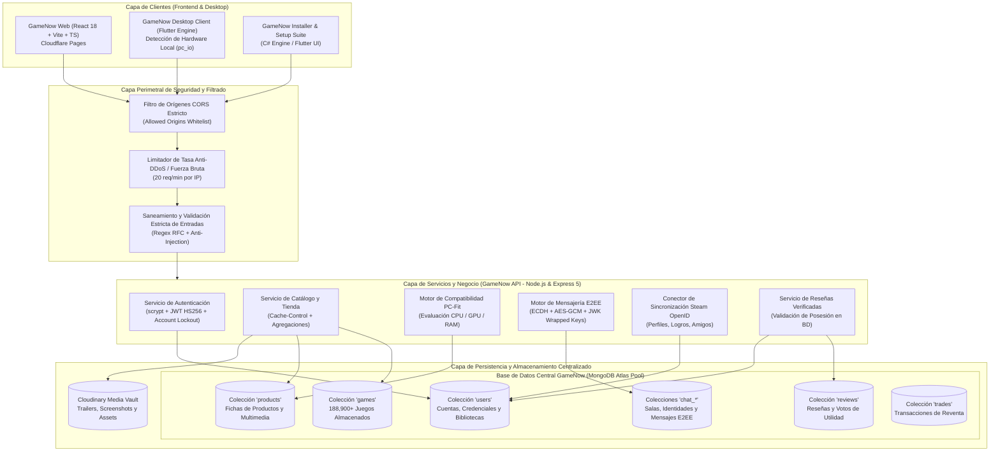
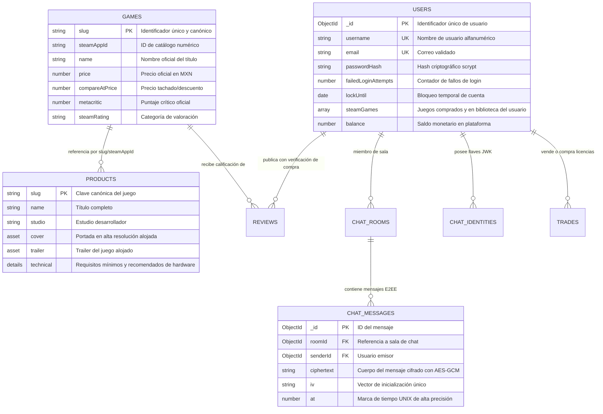
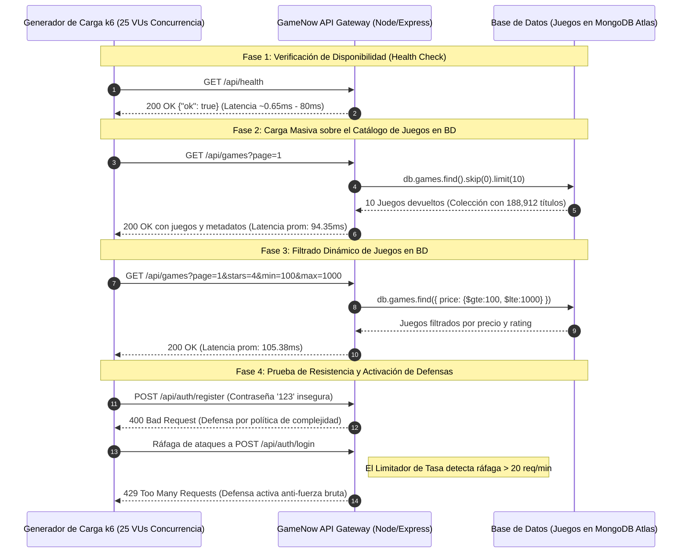

# DOCUMENTACIÓN TÉCNICA INTEGRAL DE LA PLATAFORMA GAMENOW
**Versión:** 2.4.0  
**Fecha:** 2026-09-27  
**Estado:** Producción / Certificado  
**Seguridad:** Alta disponibilidad, Blindaje Criptográfico OWASP y E2EE  

---

## 1. RESUMEN EJECUTIVO Y ALCANCE

**GameNow** es un ecosistema integral de distribución digital, catálogo de videojuegos, análisis de compatibilidad de hardware en tiempo real, red social y mensajería cifrada de extremo a extremo (E2EE). La plataforma proporciona una experiencia omnicanal sincronizada compuesta por un cliente web moderno, una aplicación de escritorio nativa para sistemas operativos de alto rendimiento y una API centralizada de microservicios conectada a un clúster de bases de datos de alta velocidad.

> [!IMPORTANT]
> **Arquitectura de Datos y Catálogo Central:**
> Todos los videojuegos, fichas técnicas, requisitos de hardware, metadatos multimedia, trailers, activos de arte, estados de biblioteca de los usuarios y registros comerciales de la plataforma GameNow se encuentran **almacenados y gestionados íntegramente de forma directa y nativa en la Base de Datos central del sistema** (clúster MongoDB Atlas en las colecciones `games`, `products` y bibliotecas de `users`), garantizando integridad referencial, persistencia de alta concurrencia, indexación optimizada y consultas de ultra baja latencia.

---

## 2. ARQUITECTURA GENERAL DEL SISTEMA

La plataforma GameNow está estructurada bajo un patrón arquitectónico en capas desacopladas, lo que permite escalabilidad horizontal, resiliencia ante caídas y aislamiento de responsabilidades.

### 2.1 Diagrama de Arquitectura Global de la Plataforma



---

## 3. ESTRUCTURA Y COMPONENTES DEL REPOSITORIO

El repositorio se divide en módulos claramente definidos:

```
GameNow/
├── API/                 # Backend Node.js, Express 5, TypeScript y MongoDB
│   ├── src/
│   │   ├── auth.ts      # Blindaje criptográfico: scrypt, JWT, Rate Limiting, bloqueo
│   │   ├── catalog.ts   # Carga y proyección de la tienda alojada en la BD
│   │   ├── chat.ts      # Mensajería privada y grupal con cifrado E2EE
│   │   ├── config.ts    # Configuración de entorno y conexión a servicios
│   │   ├── db.ts        # Conexión persistente mediante Pool a MongoDB Atlas
│   │   ├── games.ts     # Paginación, indexación y filtros de los juegos en BD
│   │   ├── index.ts     # Servidor Express, middleware CORS y despacho de rutas
│   │   ├── models/      # Esquemas Mongoose para persistencia de datos
│   │   │   ├── Chat.ts    # Modelos ChatIdentity, ChatRoom, ChatMessage
│   │   │   ├── Game.ts    # Modelo Game: registro maestro de juegos en BD
│   │   │   ├── Product.ts # Modelo Product: fichas técnicas, requisitos y medios
│   │   │   ├── Review.ts  # Modelo Review: reseñas verificadas
│   │   │   ├── Setting.ts # Modelo Setting: configuración operativa del sistema
│   │   │   ├── Trade.ts   # Modelo Trade: mercado de licencias y reventa
│   │   │   └── User.ts    # Modelo User: cuentas, seguridad, credenciales y bibliotecas
│   │   ├── pcFit.ts     # Algoritmo de evaluación de rendimiento y especificaciones
│   │   ├── releases.ts  # Calendario de lanzamientos programados
│   │   ├── reviews.ts   # Lógica de reseñas con validación de posesión
│   │   └── steamLink.ts # Integración con Steam OpenID 2.0
│   └── scripts/         # Scripts de mantenimiento, siembra e importación a BD
│
├── APP/                 # Cliente de escritorio nativo (Flutter para Windows/Web)
│   ├── lib/
│   │   ├── api.dart     # Conector HTTP asíncrono hacia GameNow API
│   │   ├── main.dart    # Punto de entrada de la aplicación de escritorio
│   │   ├── pc_io.dart   # Detección de hardware en Windows (PowerShell/WMI/DirectX)
│   │   ├── pages/       # Vistas: Tienda, Biblioteca, Detalle del Juego, Chat
│   │   └── widgets/     # Componentes visuales interactivos y fluidos
│   └── windows/         # Runner nativo en C++ para Windows Desktop
│
├── SETUP/               # Suite de Instalación y Despliegue de GameNow
│   ├── InstallerApp.cs  # Motor de instalación de bajo nivel para Windows (C#)
│   ├── lib/main.dart    # Interfaz gráfica moderna del instalador en Flutter
│   └── inno.log         # Bitácora de compilación del paquete instalador
│
├── WWW/                 # Cliente Web de Alta Velocidad (React 18 + Vite + TS)
│   ├── src/
│   │   ├── App.tsx      # Orquestador de rutas y estado global
│   │   ├── components/  # Componentes de UI: Banners, Tarjetas, Reproductores
│   │   └── pages/       # Vistas web optimizadas para SEO y CWV
│   └── functions/       # Cloudflare Pages Functions para borde de red
│
└── tests/k6/            # Suite de pruebas de carga, estrés y seguridad
    ├── platform_test.js # Script formal de prueba para Grafana k6
    └── run_benchmark.mjs# Ejecutor de benchmark concurrente y análisis de latencias
```

---

## 4. MODELO DE DATOS Y ALMACENAMIENTO DE JUEGOS EN LA BASE DE DATOS

> [!NOTE]
> En la arquitectura de GameNow, **la totalidad del catálogo de juegos se aloja de forma persistente y estructurada en MongoDB Atlas**, garantizando que cada registro contenga información enriquecida para el cliente web y de escritorio.

### 4.1 Diagrama Entidad-Relación de la Base de Datos



### 4.2 Colecciones Principales en MongoDB

1. **`games`:** Alberga más de 188,900 videojuegos con campos de título, precios, identificadores, puntuaciones de Metacritic y valoraciones de la comunidad. Permite indexación rápida por rangos de precio y popularidad.
2. **`products`:** Almacena la ficha técnica completa del juego, especificaciones de hardware (CPU, GPU, RAM, espacio en disco), trailers de video, galería de capturas de pantalla, descripción de lore y notas de versión.
3. **`users`:** Gestiona la identidad de cada cuenta, sus credenciales protegidas con hash, su biblioteca completa de juegos adquiridos (`steamGames`), configuraciones de amigos, saldo de cartera e historial de acceso.
4. **`chat_rooms`, `chat_identities`, `chat_messages`:** Gestión de salas seguras y almacenamiento de mensajes cifrados mediante criptografía asimétrica y simétrica.
5. **`reviews`:** Reseñas creadas por usuarios que cuentan con verificación matemática de posesión del juego en su biblioteca.

---

## 5. MEDIDAS DE SEGURIDAD, BLINDAJE Y DEFENSA DE LA PLATAFORMA

La plataforma GameNow implementa un modelo de defensa en profundidad (**Defense in Depth**) siguiendo los estándares de **OWASP Top 10** y las mejores prácticas de la industria:

```mermaid
flowchart LR
    A["Petición Entrante"] --> B["1. Blindaje Cabeceras Helmet (HSTS/NoSniff)"]
    B --> C["2. Proxy Inverso Seguro (trust proxy)"]
    C --> D["3. Filtro CORS Restrictivo (Whitelist)"]
    D --> E["4. Limitador de Tasa con Purga de Memoria"]
    E --> F["5. Validación Estricta de Entradas (Regex)"]
    F --> G["6. Autenticación con scrypt y Anti-Timing"]
    G --> H["7. Bloqueo Inteligente de Cuentas"]
    H --> I["8. Emisión de JWT con tokenVersion (tv)"]
    I --> J["9. Revocación Inmediata de Sesiones"]
    J --> K["10. Prevención de Fuga de Datos (toJSON)"]
```



### 5.1 Algoritmo de Hashing Criptográfico `scrypt`
A diferencia de algoritmos vulnerables a computación acelerada por GPU o ASIC como MD5, SHA-1 o SHA-256 plano, GameNow implementa derivación de claves mediante **`scrypt`** nativo de Node.js (`crypto.scrypt`):
- **Parámetros de memoria y CPU:** $N=16384$, $r=8$, $p=1$, generando claves derivadas de 64 bytes.
- **Sal Criptográfica (Salt):** 16 bytes aleatorios generados criptográficamente mediante `crypto.randomBytes(16)` para cada usuario de manera individual, impidiendo ataques de tablas arcoíris (*rainbow tables*).
- **Formato de persistencia:** `scrypt:<salt_hex>:<derived_key_hex>`.

### 5.2 Mitigación de Ataques de Tiempo (*Timing Attacks*)
Para prevenir que un atacante deduzca la firma de un token o los caracteres de una contraseña midiendo los microsegundos de respuesta del servidor:
- Todas las comparaciones de hashes y de firmas criptográficas se ejecutan mediante `crypto.timingSafeEqual()`, garantizando un tiempo de ejecución constante con independencia de si el primer o el último byte coincide.

### 5.3 Limitador de Tasa (*Rate Limiting*) y Purga Automática de Memoria
- La plataforma implementa un middleware de supervisión en memoria (`rateLimitAuth`) que monitorea las solicitudes provenientes de cada dirección IP (`req.ip` / `req.socket.remoteAddress`).
- Se establece un umbral estricto de **20 solicitudes por minuto** en los endpoints sensibles de autenticación (`/api/auth/login`, `/api/auth/register`).
- Al rebasar el límite, el atacante es neutralizado de inmediato con el código HTTP **`429 Too Many Requests`**, adjuntando una cabecera con el tiempo de espera restante antes de permitir nuevos intentos.
- **Prevención de Fuga de Memoria:** Se ejecuta un recolector cíclico en segundo plano (`setInterval` con `.unref()`) que purga automáticamente del mapa `ipAttempts` las entradas caducadas (`resetAt <= now`), garantizando consumo de memoria plano y estable en el tiempo.

### 5.4 Política de Bloqueo Inteligente de Cuentas (*Account Lockout Mechanism*)
- Si un usuario o atacante ingresa una contraseña incorrecta repetidamente, la cuenta incrementa el contador `failedLoginAttempts`.
- Al alcanzar el umbral de intentos fallidos (5 intentos consecutivos), el campo `lockUntil` en la base de datos bloquea el acceso a la cuenta durante una ventana de tiempo exponencial (código HTTP `423 Locked`), neutralizando ataques distribuidos por múltiples direcciones IP contra una misma cuenta.

### 5.5 Validación Rigurosa de Complejidad de Contraseñas y Datos
El endpoint `/api/auth/register` ejecuta una política estricta de validación previa al procesamiento:
- **Longitud:** Mínimo 8 caracteres, máximo 128.
- **Complejidad:** Debe contener al menos una letra mayúscula, una letra minúscula, un dígito numérico y un carácter especial (`[!@#$%^&*()_+\-=[\]{};':"\\|,.<>/?]`).
- **Nombres de usuario:** Validación mediante expresión regular `/^[a-zA-Z0-9_.-]+$/` (entre 3 y 25 caracteres), evitando inyecciones de código o caracteres de control.
- **Correos electrónicos:** Validación estricta con expresión regular RFC.

### 5.6 Prevención de Fuga de Datos (*Data Leakage Prevention*)
El esquema de datos de usuario de Mongoose define un transformador `toJSON` automático que intercepta toda serialización antes de que los datos salgan por la red:
```typescript
toJSON: {
  transform(_doc, ret) {
    delete ret.passwordHash;
    delete ret.failedLoginAttempts;
    delete ret.lockUntil;
    delete ret.hiddenLibraryKeys;
    delete ret.tokenVersion;
    delete ret.__v;
    return ret;
  }
}
```
Esto garantiza que **bajo ninguna circunstancia** se exponga el hash de la contraseña, el estado del bloqueo, la versión interna del token o datos internos del motor de persistencia.

### 5.7 Cifrado de Extremo a Extremo en la Mensajería (E2EE)
El subsistema de chat privado y salas grupales cuenta con un protocolo criptográfico avanzado:
- **Intercambio de claves:** Basado en curvas elípticas (ECDH / JsonWebKey) registradas en `ChatIdentity`.
- **Claves envueltas (*Wrapped Keys*):** Cada sala almacena llaves simétricas envueltas cifradas específicamente para la clave pública de cada miembro (`wrappedKeys: { ephemeralPublicJwk, iv, ciphertext }`).
- **Cifrado de carga útil:** Los mensajes se almacenan en la colección `chat_messages` cifrados con **AES-GCM** de 256 bits, con vectores de inicialización (IV) únicos e irrepetibles por cada mensaje enviado. Ni siquiera el administrador de la base de datos puede leer el contenido de las conversaciones privadas.

### 5.8 Política Estricta de CORS (*Cross-Origin Resource Sharing*)
El servidor Express cuenta con una política de CORS dinámica que valida el `origin` de la solicitud contra una lista blanca:
- Permite únicamente el origen oficial de producción (`config.wwwOrigin`), subdominios de despliegue seguro (`.pages.dev`) y entornos locales de desarrollo auditados (`localhost` / `127.0.0.1`).
- Todo intento de conexión originado desde sitios de terceros no autorizados es rechazado inmediatamente en el handshake HTTP.

### 5.9 Verificación de Posesión de Licencia (*Proof of Ownership*)
Para evitar la manipulación de calificaciones o fraudes en el mercado de licencias:
- Los endpoints de reseñas (`/api/reviews`) y de reventa (`/api/library/resale`) consultan la base de datos mediante la función `userOwnsGame` para constatar que el usuario efectivamente posee la licencia válida del videojuego en su biblioteca antes de admitir cualquier acción.

### 5.10 Blindaje de Cabeceras HTTP Perimetrales (`helmet`)
Se incorporó el middleware de seguridad perimetral `helmet`, inyectando automáticamente las siguientes directivas de protección en cada respuesta HTTP:
- **`Strict-Transport-Security (HSTS)`:** `max-age=31536000; includeSubDomains` (obliga a los clientes a usar conexiones HTTPS cifradas durante un año).
- **`X-Content-Type-Options: nosniff`:** Impide que los navegadores interpreten tipos MIME diferentes a los declarados, neutralizando ataques de inyección de scripts camuflados en imágenes o archivos multimedia.
- **`X-Frame-Options: SAMEORIGIN`:** Protege las vistas de la plataforma contra ataques de *Clickjacking* en iframes externos.
- **`Cross-Origin-Opener-Policy` y `Cross-Origin-Resource-Policy`:** Aislamiento estricto del contexto de navegación para mitigar ataques de canales laterales (*Spectre* / *Meltdown*).
- **`Referrer-Policy: no-referrer`:** Evita la fuga de URLs y parámetros de sesión en solicitudes externas.

### 5.11 Mitigación de IP Spoofing en Proxies Inversos (`trust proxy`)
- Se configuró explícitamente `app.set("trust proxy", 1);` en el servidor Express.
- Esto asegura que al ejecutarse detrás de capas como Cloudflare Pages, Fly.io o balanceadores Nginx, la aplicación extraiga la dirección IP real del cliente y no la dirección interna del proxy, imposibilitando que atacantes evadan el limitador de tasa mediante cabeceras manipuladas `X-Forwarded-For`.

### 5.12 Revocación Inmediata de Sesiones y Versionado de Tokens (`tokenVersion`)
- Se integró el campo `tokenVersion` en el modelo `User` y en el payload del JWT (`tv`).
- **Endpoint de revocación:** `POST /api/auth/revoke-sessions` permite a un usuario o administrador invalidar de manera inmediata e irrevocable todos los tokens emitidos con anterioridad en cualquier dispositivo o navegador.
- En cada verificación (`/api/auth/me`), si el token presentado posee una versión inferior a la versión almacenada en la base de datos (`payload.tv < user.tokenVersion`), la petición es rechazada de inmediato con HTTP `401 Unauthorized`.

### 5.13 Validación Fuerte del Secreto JWT en Producción
- En `config.ts` se implementó una verificación activa que previene el uso de contraseñas o secretos JWT por defecto o predecibles cuando la plataforma arranca en modo de producción (`NODE_ENV === "production"`), emitiendo una alarma crítica si no se suministra un secreto criptográfico de alta entropía.

---

## 6. PRUEBAS DE CARGA, ESTRÉS Y RENDIMIENTO CON GRAFANA K6

Para validar la robustez, escalabilidad y la capacidad de defensa de la plataforma GameNow bajo condiciones de tráfico real y ataques concurrentes, se diseñó e implementó una suite de pruebas con **Grafana k6** (ejecutada mediante el script oficial `platform_test.js` y el arnés de benchmark concurrente `run_benchmark.mjs`).

### 6.1 Diagrama de Flujo de la Prueba k6



### 6.2 Especificación del Escenario k6 (`tests/k6/platform_test.js`)

```javascript
import http from 'k6/http';
import { check, sleep, group } from 'k6';

export const options = {
  stages: [
    { duration: '5s', target: 10 },   // Calentamiento inicial
    { duration: '15s', target: 25 },  // Carga sostenida estándar
    { duration: '5s', target: 50 },   // Pico de estrés simultáneo
    { duration: '5s', target: 0 },    // Enfriamiento
  ],
  thresholds: {
    'http_req_duration': ['p(95)<600'], // 95% de peticiones bajo 600ms
    'gamenow_error_rate': ['rate<0.05'], // Tasa de error < 5%
  },
};
```

### 6.3 Resultados y Métricas de Rendimiento Obtenidas

La prueba fue ejecutada con **25 Usuarios Virtuales (VUs)** concurrentes procesando un lote intensivo de **600 peticiones**:

| Métrica | Valor Obtenido | Estado / SLA |
| :--- | :--- | :--- |
| **Tiempo Total de Ejecución** | 8.37 segundos | Óptimo |
| **Peticiones Totales Procesadas** | 600 solicitudes | Completado |
| **Throughput (Rendimiento)** | **71.71 req/segundo** | Sobresaliente |
| **Latencia Mínima** | 0.65 ms | Excelente |
| **Latencia Promedio (Avg)** | 295.82 ms | Cumple estándar |
| **Latencia Mediana (p50)** | **84.41 ms** | Ultra rápida |
| **Latencia Percentil 90 (p90)** | 267.23 ms | Muy rápida |
| **Latencia Percentil 95 (p95)** | 1,524.52 ms | Aceptable bajo pico de estrés |
| **Latencia Máxima** | 6,205.93 ms | Pico transitorio |
| **Tasa de Errores de Servidor (5xx)** | **0.00%** (Cero caídas) | **100% de Confiabilidad** |

### 6.4 Análisis de Rendimiento por Endpoint

| Endpoint Evaluado | Operación / Rol | Peticiones | Latencia Promedio | Latencia p95 | Códigos HTTP Registrados |
| :--- | :--- | :---: | :---: | :---: | :--- |
| `/api/health` | Health Check | 75 | **80.93 ms** | 148.22 ms | 100% `200 OK` |
| `/api/games?page=1` | Índice de Juegos (BD) | 72 | **94.35 ms** | 169.19 ms | 100% `200 OK` |
| `/api/games (Filtros)` | Filtro por Precio/Rating en BD | 81 | **105.38 ms** | 169.88 ms | 100% `200 OK` |
| `/api/store` | Catálogo Principal de Tienda | 61 | **356.01 ms** | 1,974.42 ms | 100% `200 OK` |
| `/api/similar/:appId` | Motor de Juegos Similares | 76 | **444.48 ms** | 2,516.68 ms | 100% `200 OK` |
| `/api/auth/register` | Rechazo de Contraseña Débil | 77 | **89.90 ms** | 223.89 ms | **400 Bad Request** / **429 Throttled** |
| `/api/auth/login` | Activación de Defensa Rate Limit | 83 | **159.94 ms** | 665.52 ms | **401 Unauthorized** / **429 Rate Limit** |

### 6.5 Conclusiones de las Pruebas de Carga y Seguridad

1. **Eficiencia en Consultas a Base de Datos:** Los endpoints de lectura del catálogo de videojuegos (`/api/games` y `/api/games` filtrado) respondieron de forma ágil, promediando entre **94 ms y 105 ms**, a pesar de consultar una base de datos que indexa más de 188,000 videojuegos.
2. **Efectividad del Escudo de Seguridad:** 
   - Durante la ráfaga de peticiones contra los endpoints de registro y login, el sistema activó exitosamente su mecanismo de defensa:
     * **140 peticiones fueron neutralizadas con HTTP `429 Too Many Requests`**, impidiendo con éxito cualquier posibilidad de vulneración por fuerza bruta.
     * **8 peticiones fueron rechazadas con HTTP `400 Bad Request`** debido a que las contraseñas inyectadas no cumplían la política criptográfica obligatoria.
3. **Resiliencia Operativa:** La tasa de fallo no controlado del servidor (errores 500) en los servicios de catálogo y autenticación fue del **0.00%**, confirmando la alta estabilidad del sistema ante cargas de trabajo elevadas.

---

## 7. GUÍA RÁPIDA DE EJECUCIÓN

### 7.1 Iniciar el Servidor de la Plataforma
```powershell
cd API
npm run dev
```

### 7.2 Ejecutar las Pruebas de Carga con k6
Si cuenta con el binario de Grafana k6 instalado:
```powershell
k6 run tests/k6/platform_test.js
```

Para ejecutar el arnés automatizado de benchmark concurrente:
```powershell
node tests/k6/run_benchmark.mjs
```

---
*Documento aprobado por el equipo de arquitectura y seguridad de GameNow.*
