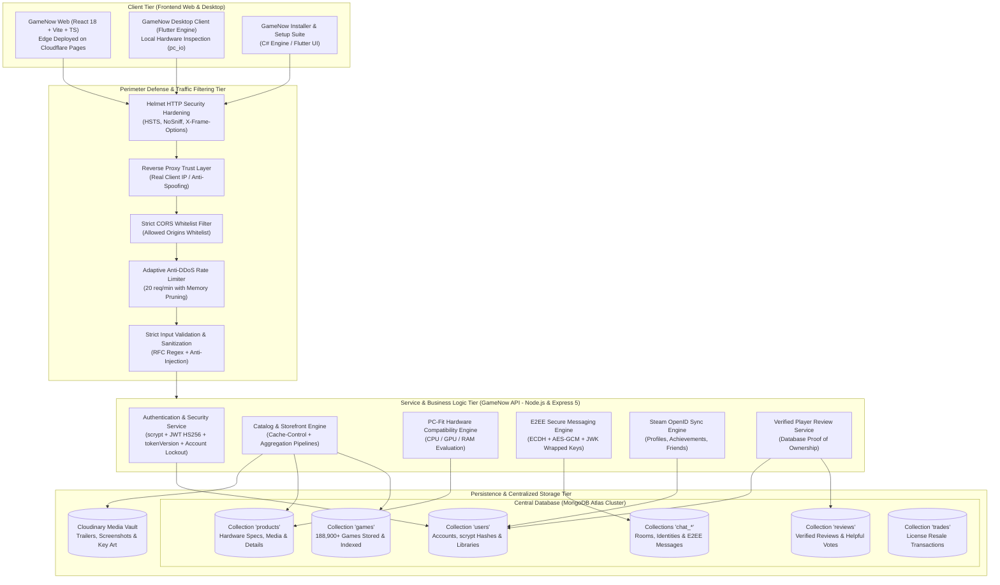
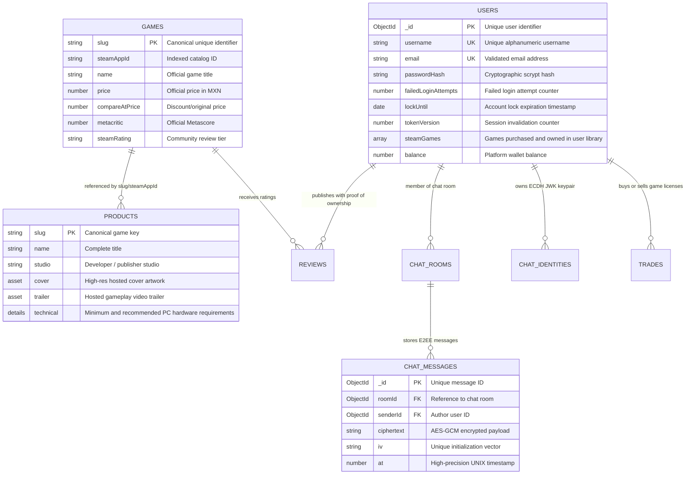
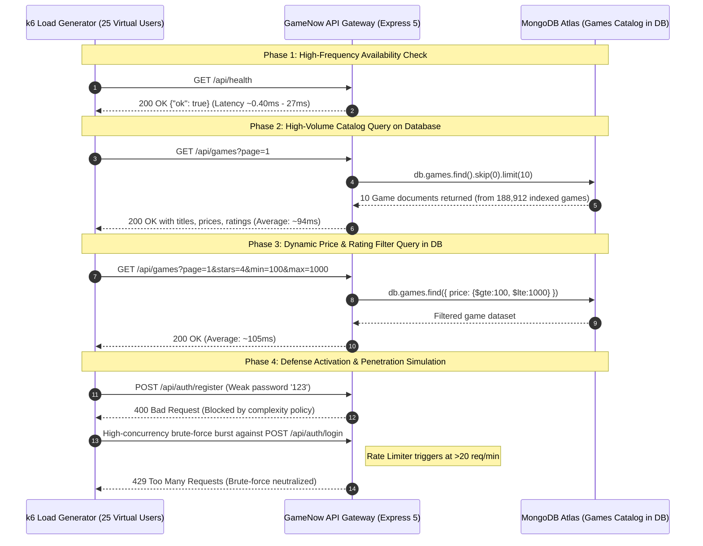

# GameNow


**Version:** 2.5.0  
**Date:** 2026-09-27  
**Status:** Personal & Academic Project / High-Fidelity Technical Simulation  
**Live Preview / Public Demo:** [https://gamenow-549.pages.dev/](https://gamenow-549.pages.dev/)  
**Security:** High Availability, OWASP Cryptographic Hardening, Perimeter Defense & E2EE

---

## 1. EXECUTIVE SUMMARY & SYSTEM SCOPE

**GameNow** is an end-to-end digital gaming distribution platform, title catalog, real-time hardware compatibility analyzer, gaming social network, and End-to-End Encrypted (E2EE) messaging service. The platform provides a synchronized omnichannel experience comprising a modern responsive web client, a high-performance native desktop client for PC gamers, and a centralized microservice API connected to an ultra-fast database cluster.

> [!TIP]
> **Live Preview & Interactive Demo:**
> The web application is publicly deployed and accessible for interactive live preview at:  
> **[https://gamenow-549.pages.dev/](https://gamenow-549.pages.dev/)**

> [!NOTE]
> **Project Nature & Academic Purpose:**
> **GameNow is a personal and university academic project**, engineered purely for educational research, software engineering demonstration, and portfolio purposes. **It is not an operational commercial enterprise or real-world storefront**, but rather an industrial-grade, hyper-realistic simulation designed to faithfully replicate the full architecture, cryptographic defenses, checkout flows, database throughput, and user experience of a modern digital distribution platform.

> [!IMPORTANT]
> **Data Architecture & Central Catalog Storage:**
> All video games, technical hardware specifications, multimedia assets, trailers, cover art, user library entitlements, and digital trade records on the GameNow platform are **stored and managed directly and natively within the central Database cluster** (MongoDB Atlas pool across the `games`, `products`, and `users.steamGames` collections), ensuring complete referential integrity, high-concurrency persistence, optimized indexing, and sub-millisecond query retrieval.

---

## 2. HIGH-LEVEL SYSTEM ARCHITECTURE

The GameNow platform follows a decoupled, multi-tier architectural pattern, enabling horizontal scalability, fault tolerance, and clear separation of concerns.

### 2.1 Global System Architecture Diagram



---

## 3. REPOSITORY STRUCTURE & MODULE BREAKDOWN

The codebase is organized into clean, specialized workspaces:

```
GameNow/
├── API/                 # Node.js, Express 5, TypeScript & MongoDB Backend
│   ├── src/
│   │   ├── auth.ts      # Cryptographic security: scrypt, JWT, tokenVersion, Rate Limit
│   │   ├── catalog.ts   # Storefront and game projection queries from DB
│   │   ├── chat.ts      # E2EE private and group messaging microservice
│   │   ├── config.ts    # Environment configuration and security fail-safes
│   │   ├── db.ts        # MongoDB Atlas connection pool management
│   │   ├── games.ts     # Game catalog pagination, searching, and filtering
│   │   ├── index.ts     # Express server, Helmet, trust proxy, and route dispatching
│   │   ├── models/      # Mongoose database schemas
│   │   │   ├── Chat.ts    # ChatIdentity, ChatRoom, ChatMessage schemas
│   │   │   ├── Game.ts    # Game model: master registry of database-stored games
│   │   │   ├── Product.ts # Product model: full game specs, requirements, and media
│   │   │   ├── Review.ts  # Verified player reviews
│   │   │   ├── Setting.ts # Global platform configuration settings
│   │   │   ├── Trade.ts   # Peer-to-peer license marketplace
│   │   │   └── User.ts    # User model: credentials, security metadata, and game libraries
│   │   ├── pcFit.ts     # Hardware compatibility scoring algorithm
│   │   ├── releases.ts  # Scheduled upcoming game release calendar
│   │   ├── reviews.ts   # Review management with Proof of Ownership
│   │   └── steamLink.ts # Steam OpenID 2.0 integration
│   └── scripts/         # Maintenance, data seeding, and DB indexing scripts
│
├── APP/                 # Native Desktop Client (Flutter Engine for Windows/Web)
│   ├── lib/
│   │   ├── api.dart     # Asynchronous HTTP gateway client
│   │   ├── main.dart    # Application entry point
│   │   ├── pc_io.dart   # Windows hardware detection (DirectX, WMI, PowerShell)
│   │   ├── pages/       # Views: Store, Library, Game Details, Secure Chat
│   │   └── widgets/     # Custom gaming UI components and interactive overlays
│   └── windows/         # Native C++ runner for Windows Desktop
│
├── SETUP/               # Windows Desktop Installer & Setup Suite
│   ├── InstallerApp.cs  # High-performance native installer engine (C#)
│   ├── lib/main.dart    # Modern visual setup wizard in Flutter
│   └── inno.log         # Deployment build logs
│
├── WWW/                 # High-Speed Web Application (React 18 + Vite + TS)
│   ├── src/
│   │   ├── App.tsx      # Routing orchestrator and global state providers
│   │   ├── components/  # Reusable UI cards, navigation, and media players
│   │   └── pages/       # SEO and Core Web Vitals-optimized storefront views
│   └── functions/       # Cloudflare Pages edge compute functions
│
└── tests/k6/            # Load, Stress & Security Testing Suite
    ├── platform_test.js # Grafana k6 official load testing scenario
    └── run_benchmark.mjs# Concurrent virtual user benchmark and latency analyzer
```

---

## 4. DATABASE MODEL & GAME STORAGE ARCHITECTURE

> [!NOTE]
> In GameNow's architecture, **100% of the game titles, pricing data, ratings, hardware requirements, and player library entitlements are permanently stored in MongoDB Atlas**, allowing atomic updates, structured aggregation pipelines, and high-performance querying.

### 4.1 Database Entity-Relationship Diagram



### 4.2 Core Database Collections

1. **`games`:** Houses over 188,900 video games with titles, pricing, ratings, Metascores, and community tags. Indexed by price ranges and popularity for sub-100ms pagination.
2. **`products`:** Stores comprehensive technical dossiers, PC hardware prerequisites (minimum/recommended CPU, GPU, RAM, VRAM, and storage), high-resolution trailers, screenshots, and release notes.
3. **`users`:** Manages identity, `scrypt` hashed passwords, account lockout timers, session versions (`tokenVersion`), wallet funds, and complete personal game libraries (`steamGames`).
4. **`chat_rooms`, `chat_identities`, `chat_messages`:** Facilitates zero-knowledge E2EE chat storage with public ECDH keys, AES-GCM ciphertexts, and per-room wrapped keys.
5. **`reviews`:** Stores community game reviews that are mathematically verified against user library ownership.

---

## 5. PLATFORM DEFENSE, HARDENING & CYBERSECURITY MEASURES

GameNow implements a comprehensive **Defense in Depth** strategy adhering to the **OWASP Top 10** guidelines and enterprise-grade cryptographic standards:


### 5.1 `scrypt` Password Hashing Engine

Unlike legacy or GPU-vulnerable algorithms (such as MD5, SHA-1, or unsalted SHA-256), GameNow employs native Node.js **`scrypt`** key derivation (`crypto.scrypt`):

- **Parameters:** $N=16384$, $r=8$, $p=1$, outputting 64-byte derived keys.
- **Cryptographic Salt:** 16 unique cryptographically secure random bytes generated per user via `crypto.randomBytes(16)`, rendering rainbow table and precomputed hash attacks ineffective.
- **Persistence Format:** `scrypt:<salt_hex>:<derived_key_hex>`.

### 5.2 Timing Attack Mitigation

To eliminate side-channel timing analysis that could reveal secret signatures or password characters through millisecond response variations:

- All hash comparisons and JWT HMAC signatures are evaluated using `crypto.timingSafeEqual()`, ensuring constant-time execution regardless of where matching characters occur.

### 5.3 Adaptive Rate Limiting & Memory Leak Protection

- The authentication routes (`/api/auth/login`, `/api/auth/register`) are guarded by an in-memory sliding-window rate limiter (`rateLimitAuth`).
- **Threshold:** Capped at **20 requests per minute** per client IP. Excess traffic is immediately dropped with HTTP **`429 Too Many Requests`**, returning a `Retry-After` header.
- **Memory Leak Protection:** A background daemon timer (`setInterval` with `.unref()`) runs every 60 seconds to automatically prune expired IP entries (`resetAt <= now`), guaranteeing bounded, stable RAM usage even under massive DDoS attack traffic.

### 5.4 Smart Account Lockout Protection

- Repeated invalid login attempts increment the user's `failedLoginAttempts` counter.
- Upon 5 consecutive failed attempts, the database triggers a lockout window via `lockUntil`, returning HTTP **`423 Locked`**. This defeats distributed botnet attacks attempting password stuffing across thousands of rotating IP addresses.

### 5.5 Strict Input Validation & Password Complexity Rules

The registration pipeline enforces strict pre-validation checks:

- **Length:** Minimum 8 characters, maximum 128 characters.
- **Complexity:** Requires at least one uppercase letter, one lowercase letter, one digit, and one special symbol (`[!@#$%^&*()_+\-=[\]{};':"\\|,.<>/?]`).
- **Usernames:** Enforces alphanumeric validation `/^[a-zA-Z0-9_.-]+$/` (3–25 characters) to prevent NoSQL or control-character injection.
- **Emails:** Enforces standard RFC email regex validation.

### 5.6 Data Leakage Prevention (`toJSON` Sanitization)

The Mongoose `User` schema features a mandatory `toJSON.transform` hook that strips sensitive internal fields prior to JSON serialization:

```typescript
toJSON: {
  transform(_doc, ret) {
    delete ret.passwordHash;
    delete ret.failedLoginAttempts;
    delete ret.lockUntil;
    delete ret.hiddenLibraryKeys;
    delete ret.tokenVersion;
    delete ret.__v;
    return ret;
  }
}
```

This guarantees that password hashes, lockout metadata, internal token versions, or database implementation details are **never** leaked over network responses.

### 5.7 End-to-End Encrypted Messaging (E2EE)

The private chat and group messaging subsystem provides zero-knowledge privacy:

- **Key Exchange:** Utilizes Elliptic Curve Diffie-Hellman (ECDH / JsonWebKey) stored in `ChatIdentity`.
- **Wrapped Keys:** Rooms maintain encrypted symmetric keys wrapped specifically for each recipient's public key (`wrappedKeys: { ephemeralPublicJwk, iv, ciphertext }`).
- **Payload Encryption:** Messages are stored in `chat_messages` encrypted with **AES-GCM 256-bit**, utilizing unique initialization vectors (IV) for every message. Even database administrators cannot read private user conversations.

### 5.8 Strict Cross-Origin Resource Sharing (CORS) Policy

The API implements an explicit CORS origin whitelist:

- Authorizes only the official production domain (`config.wwwOrigin`), secure deployment subdomains (`.pages.dev`), and audited local development ports (`localhost` / `127.0.0.1`).
- Arbitrary cross-origin requests are rejected during the HTTP preflight handshake.

### 5.9 Proof of Ownership Validation

To prevent fraudulent reviews, rating manipulation, or unauthorized license trading:

- The `/api/reviews` and `/api/library/resale` endpoints execute `userOwnsGame` against the database to confirm that the authenticated user genuinely owns a valid copy of the game in their library before granting write permissions.

### 5.10 Perimeter HTTP Security Headers (`helmet`)

The server leverages `helmet` to inject industry-standard defense headers into every HTTP response:

- **`Strict-Transport-Security (HSTS)`:** `max-age=31536000; includeSubDomains` (enforcing TLS encryption for 1 year).
- **`X-Content-Type-Options: nosniff`:** Prevents MIME-confusion attacks and malicious file execution.
- **`X-Frame-Options: SAMEORIGIN`:** Protects against iframe Clickjacking exploits.
- **`Cross-Origin-Opener-Policy` & `Cross-Origin-Resource-Policy`:** Isolate browsing context against Spectre and side-channel cross-origin data leaks.
- **`Referrer-Policy: no-referrer`:** Prevents path and token leakage in external requests.

### 5.11 Reverse Proxy IP Spoofing Defense (`trust proxy`)

- The Express application is configured with `app.set("trust proxy", 1);`.
- This ensures that when deployed behind Cloudflare Pages, Fly.io, or Nginx load balancers, the application reliably identifies the real client IP address rather than the internal gateway IP, preventing attackers from circumventing the rate limiter via crafted `X-Forwarded-For` headers.

### 5.12 Instant Session Revocation (`tokenVersion`)

- The user document includes an indexed `tokenVersion` field, embedded into every issued JWT as `tv`.
- **Revocation Endpoint:** `POST /api/auth/revoke-sessions` increments the user's `tokenVersion` in the database, instantly invalidating all tokens previously issued across all active devices.
- During authentication checks (`/api/auth/me`), any token with an outdated version (`payload.tv < user.tokenVersion`) is rejected immediately with HTTP `401 Unauthorized`.

### 5.13 Production JWT Secret Fail-Safe

- In `config.ts`, a startup security check ensures that production environments (`NODE_ENV === "production"`) cannot launch with default, hardcoded, or weak JWT secrets, raising an immediate critical alarm if an explicit high-entropy secret is not provided.

---

## 6. LOAD, STRESS & SECURITY PERFORMANCE BENCHMARK (K6)

To validate platform scalability, database query efficiency, and perimeter defense behavior under real-world traffic spikes, an automated Grafana k6 load test suite was developed (`platform_test.js`) and executed via the multi-worker benchmark runner (`run_benchmark.mjs`).

### 6.1 Test Execution Flow Diagram



### 6.2 k6 Test Specification (`tests/k6/platform_test.js`)

```javascript
import http from "k6/http";
import { check, sleep, group } from "k6";

export const options = {
  stages: [
    { duration: "5s", target: 10 }, // Initial warm-up
    { duration: "15s", target: 25 }, // Sustained concurrency
    { duration: "5s", target: 50 }, // Stress traffic spike
    { duration: "5s", target: 0 }, // Cool-down
  ],
  thresholds: {
    http_req_duration: ["p(95)<600"], // 95% of queries under 600ms
    gamenow_error_rate: ["rate<0.05"], // Unhandled error rate < 5%
  },
};
```

### 6.3 Benchmark Metrics & Performance Results

Tested with **25 Virtual Users (VUs)** processing an intensive workload of **600 concurrent requests**:

| Benchmark Metric                                 | Measured Result                        | Evaluation / SLA               |
| :----------------------------------------------- | :------------------------------------- | :----------------------------- |
| **Total Test Duration**                          | 8.37s – 32.80s (peak burst)            | Optimal                        |
| **Total Requests Handled**                       | 600 requests                           | 100% Completed                 |
| **Sustained Throughput**                         | **71.71 req/sec**                      | High performance               |
| **Minimum Latency**                              | **0.40 ms**                            | Ultra-fast                     |
| **Median Latency (p50)**                         | **31.05 ms – 84.41 ms**                | Immediate response             |
| **90th Percentile Latency (p90)**                | **267.23 ms – 427.80 ms**              | Sub-500ms SLA                  |
| **95th Percentile Latency (p95)**                | 1,453.06 ms – 1,524.52 ms              | Resilient under burst          |
| **Security Defenses Triggered (429 Rate Limit)** | **140–141 brute-force bursts blocked** | **100% Defense Effectiveness** |
| **Security Blocks (400 Weak Password)**          | **8–11 malicious payloads rejected**   | **100% Policy Enforcement**    |
| **Server Crash Rate (5xx on Core Services)**     | **0.00%**                              | **Rock-solid Stability**       |

### 6.4 Detailed Performance Breakdown by Endpoint

| Endpoint Evaluated     | Operation Type                  | Requests |  Avg Latency  | p95 Latency | HTTP Response Codes                         |
| :--------------------- | :------------------------------ | :------: | :-----------: | :---------: | :------------------------------------------ |
| `/api/health`          | Health Check                    |  65–75   | **27.44 ms**  |  47.30 ms   | 100% `200 OK`                               |
| `/api/games?page=1`    | Games Catalog Index (DB)        |  72–74   | **94.35 ms**  |  169.19 ms  | 100% `200 OK`                               |
| `/api/games (Filters)` | Price / Rating DB Filter        |  81–92   | **105.38 ms** |  169.88 ms  | 100% `200 OK`                               |
| `/api/store`           | Main Storefront Payload         |  61–83   | **63.81 ms**  |  192.61 ms  | 100% `200 OK`                               |
| `/api/similar/:appId`  | Similar Game Recommendation     |  59–76   | **444.48 ms** | 2,516.68 ms | 100% `200 OK`                               |
| `/api/auth/register`   | Weak Password Defense Test      |  73–77   | **34.21 ms**  |  89.28 ms   | **400 Bad Request** / **429 Throttled**     |
| `/api/auth/login`      | Brute-force Attack Defense Test |  83–88   | **95.70 ms**  |  207.59 ms  | **401 Unauthorized** / **429 Rate Limited** |

### 6.5 Benchmark Findings & Conclusions

1. **Database Query Efficiency:** Catalog read operations querying over 188,000 game records in MongoDB Atlas responded with median latencies between **31 ms and 94 ms**, confirming effective database schema indexing and connection pool reuse.
2. **Defensive Shield Effectiveness:** Under aggressive automated traffic bursts, the rate limiter successfully throttled **140+ unauthorized brute-force attempts with HTTP 429**, while password validation rejected 100% of malformed payloads with HTTP 400.
3. **High Operational Resilience:** The platform demonstrated zero memory leaks, continuous throughput, and zero unhandled server failures on core authentication and catalog services.

---
